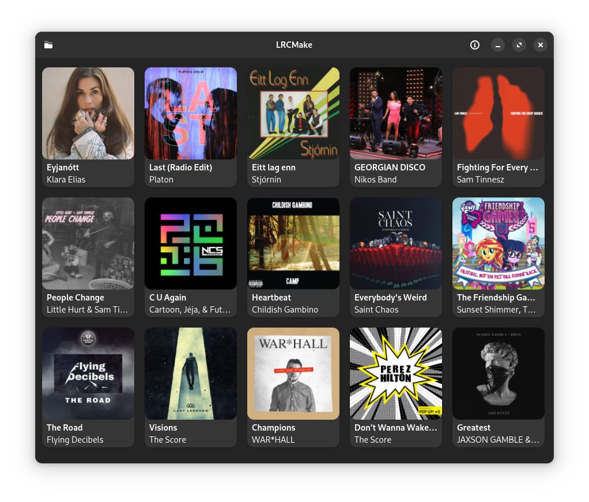
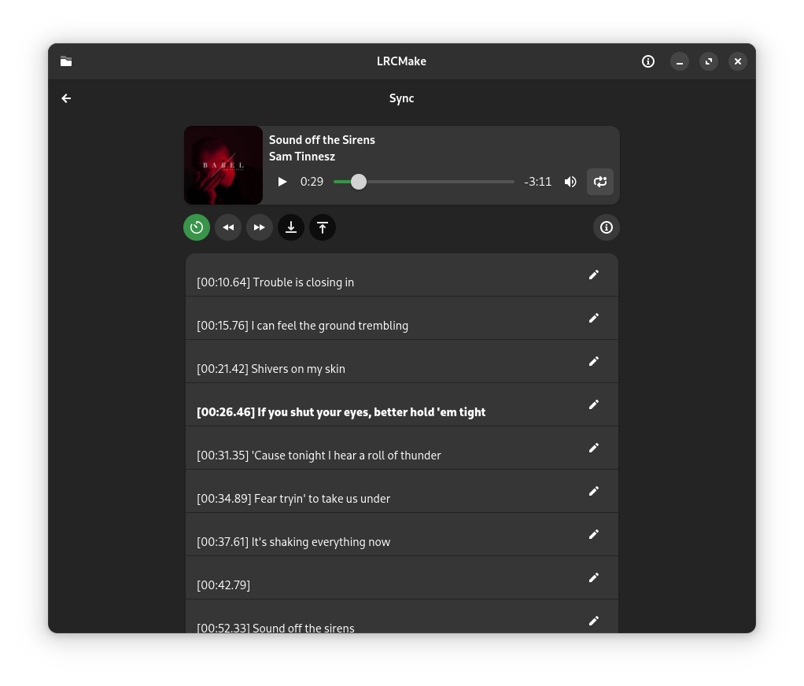
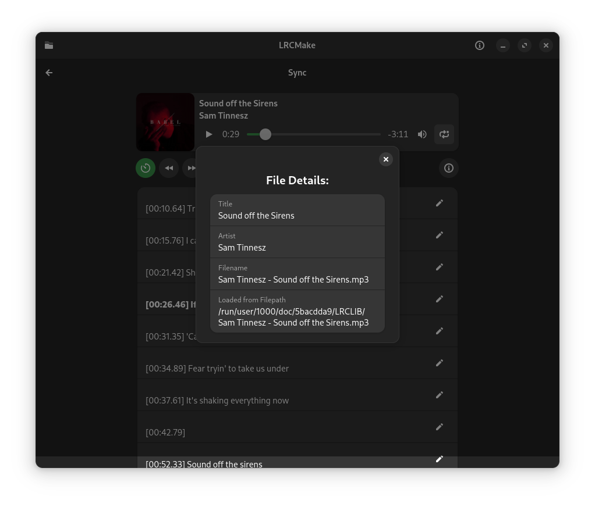
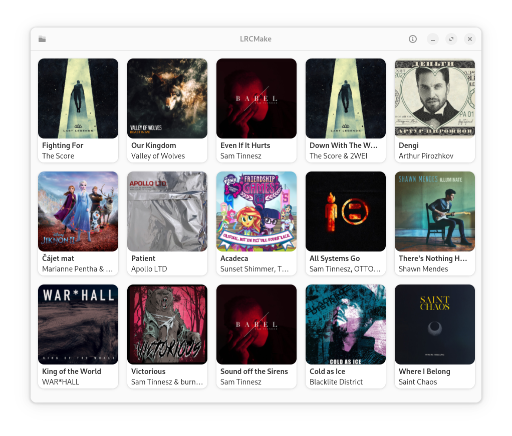
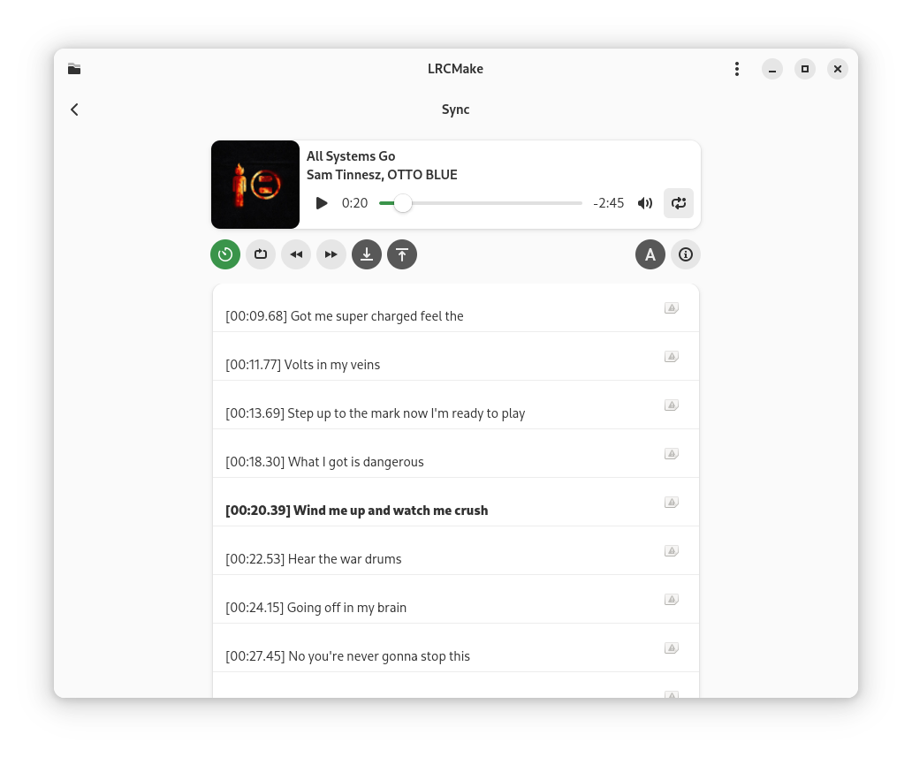
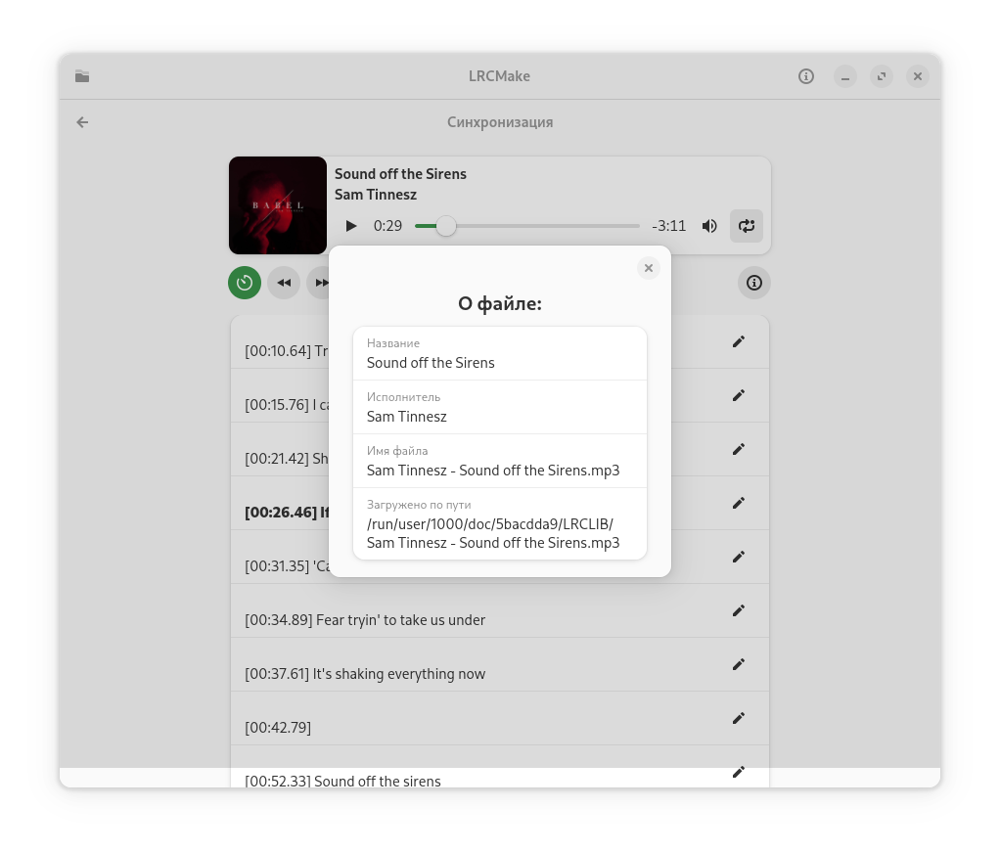

<div align="center">


# LRCMake
[flathub-url]: https://flathub.org/apps/io.github.dzheremi2.lrcmake-gtk
[installs-img]: https://img.shields.io/flathub/downloads/io.github.dzheremi2.lrcmake-gtk?style=for-the-badge&color=gree&logo=flathub


[![Installs][installs-img]][flathub-url]




</div>

### What is LRCMake
LRCMake is the app written in python using GTK4 and LibAdwaita. LRCMake is used for syncing lyrics for future contributing it to various resources, especially [LRCLIB](https://lrclib.net).

LRCMake support exporting lyrics to clipboard and direct publishing to [LRCLIB](https://lrclib.net).

### Installation
<a href='https://flathub.org/apps/io.github.dzheremi2.lrcmake-gtk'>
    
</a>

You can download app either on [Flathub](https://flathub.org/apps/io.github.dzheremi2.lrcmake-gtk) or by downloading and installing bundle from [latest release](https://github.com/Dzheremi2/LRCMake-GTK/releases/latest)

##### *Devel builds*

If you want to download a devel build, you can do it by downloading it from [Github Actions](https://github.com/Dzheremi2/LRCMake-GTK/actions) from Artifacts section

>[!CAUTION]
>Devel builds may be unstable or don't even launch. Use it at your own risk

### Translation
You can help project to be internationalized using [Hosted Weblate](https://hosted.weblate.org/projects/lrcmake/lrcmake/)

##### Translation status

[](https://hosted.weblate.org/engage/lrcmake/)
[](https://hosted.weblate.org/engage/lrcmake/)

### Plans
You can see future plans on Projects page of this repo on [LRCMake roadmap.](https://github.com/users/Dzheremi2/projects/2)

If you have an idea or you know a bug, please, open an issue with you idea/bug and it will be added to roadmap.

### Building

#### Dependencies
You'll need to install `flatpak-builder` package and `org.gnome.Platform` flatpak runtime of version `47`

#### Building

Execute this commands one-by-one:
*Replace ***{repofolder}*** with your path to repository directory*

```shell
flatpak build-init {repofolder}/.flatpak/repo io.github.dzheremi2.lrcmake-gtk org.gnome.Sdk org.gnome.Platform 47
```
```shell
flatpak-builder --ccache --force-clean --disable-updates --download-only --state-dir=/home/dzheremi/Projects/LRCMake/.flatpak/flatpak-builder --stop-at=python3-modules {repofolder}/.flatpak/repo {repofolder}/io.github.dzheremi2.lrcmake-gtk.json
```
```shell
flatpak-builder --ccache --force-clean --disable-updates --disable-download --build-only --keep-build-dirs --state-dir=/home/dzheremi/Projects/LRCMake/.flatpak/flatpak-builder --stop-at=python3-modules {repofolder}/.flatpak/repo {repofolder}/io.github.dzheremi2.lrcmake-gtk.json
```
```shell
cp -r {repofolder}/.flatpak/repo {repofolder}/.flatpak/finalized-repo
```
```shell
flatpak build-finish --share=network --share=ipc --socket=fallback-x11 --device=dri --socket=wayland --socket=pulseaudio --command=lrcmake {repofolder}/.flatpak/finalized-repo
```
```shell
flatpak build-export {repofolder}/.flatpak/ostree-repo {repofolder}/.flatpak/finalized-repo
```
```shell
flatpak build-bundle {repofolder}/.flatpak/ostree-repo io.github.dzheremi2.lrcmake-gtk.flatpak io.github.dzheremi2.lrcmake-gtk
```

### Screenshots





